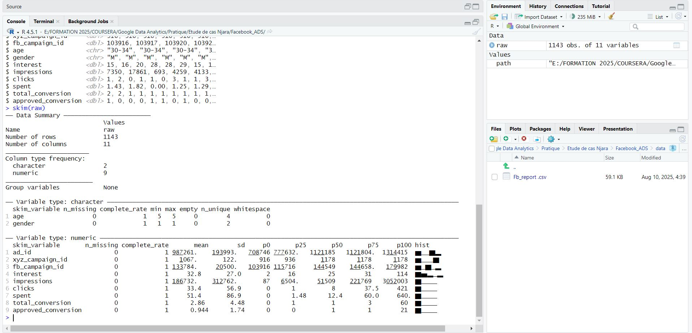
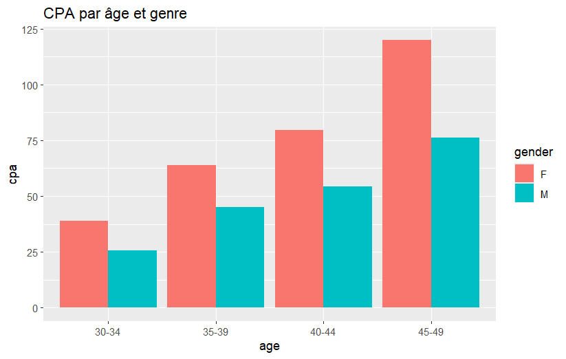
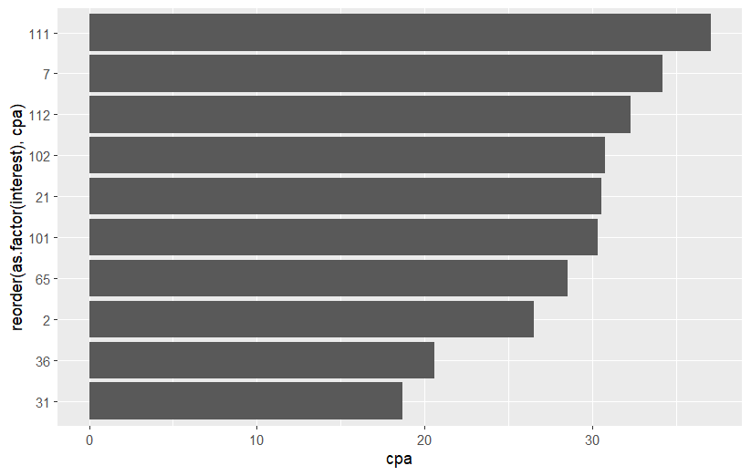
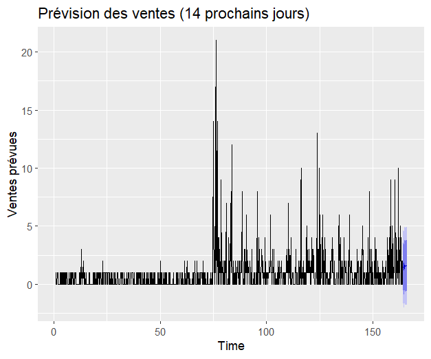

# Facebook Ads – Analyse & Prévision (R)

**Auteur :** Njaratiana  
**Tech :** R (tidyverse, janitor, skimr, forecast)  
**Objectif :** Analyser la performance d'une campagne Facebook Ads et produire des recommandations activables.

---

## 1) Aperçu du projet

- **Jeu de données :** `data/Fb_report.csv` (1 143 lignes, 11 colonnes)
- **Livrables :**
  - Rapport HTML (R Markdown) : `report/R_Markdown-report.html`
  - Visualisations clés : `plots/*.png|jpg`
- **Questions business :**
  1. Quel est le **CPA** par **âge** et **genre** ?  
  2. Quels **centres d’intérêt** sont les plus rentables (CPA bas) ?  
  3. Quelle **prévision de ventes** sur 14 jours ?

---

## 2) Structure du dépôt

```
Facebook_Ads_Analysis/
├── README.md
├── data/
│   └── Fb_report.csv
├── report/
│   ├── R_Markdown report.Rmd
│   └── R_Markdown-report.html
└── plots/
    ├── cpa_age_gender.png
    ├── interest_performance.png
    ├── sales_forecast.png
    ├── glimpse.jpg
    ├── skim_raw.jpg
    ├── import.jpg
    ├── analyze_env.jpg
    ├── interest_console.jpg
    └── sales_console.jpg
```

> **Note Kaggle :** les images s’affichent parfaitement sur GitHub. Sur Kaggle *Dataset*, elles peuvent ne pas s’afficher dans la description ; utilisez le **Notebook Kaggle** (voir section 7) pour les visualiser.

---

## 3) Reproductibilité – environnement R

Installer/charger les packages requis :

```r
# Installer au besoin
pkgs <- c("tidyverse","janitor","skimr","here","forecast","fable","feasts") # fable/feasts optionnels
inst <- pkgs[!(pkgs %in% installed.packages()[,"Package"])]
if(length(inst)) install.packages(inst, dependencies = TRUE)

# Charger
library(tidyverse)
library(janitor)
library(skimr)
library(here)
library(forecast)
```

---

## 4) Import & nettoyage

```r
# Pointage fichier
path <- here("data","Fb_report.csv")

# Import + nettoyage colonnes
raw <- readr::read_csv(path, show_col_types = FALSE) %>%
  clean_names()

# Aperçu rapide
glimpse(raw)
skim(raw)
```

**Captures / sorties :**
- 
- 

---

## 5) KPI par âge & genre (CPA)

```r
data <- raw %>%
  mutate(
    clicks = as.numeric(clicks),
    spent  = as.numeric(spent),
    approved_conversion = as.numeric(approved_conversion)
  )

by_demo <- data %>%
  group_by(age, gender) %>%
  summarise(
    impressions = sum(impressions, na.rm = TRUE),
    clicks      = sum(clicks, na.rm = TRUE),
    spent       = sum(spent, na.rm = TRUE),
    approved    = sum(approved_conversion, na.rm = TRUE),
    ctr = clicks / pmax(impressions, 1),
    cpc = spent  / pmax(clicks, 1),
    cpm = spent  / pmax(impressions, 1) * 1000,
    cpa = spent  / pmax(approved, 1),
    .groups = "drop"
  )

ggplot(by_demo, aes(x = age, y = cpa, fill = gender)) +
  geom_col(position = position_dodge()) +
  labs(title = "CPA par âge et genre", x = "âge", y = "CPA")
```

**Visuel :**


---

## 6) Top intérêts (CPA le plus bas)

```r
by_interest <- data %>%
  group_by(interest) %>%
  summarise(
    impressions = sum(impressions, na.rm = TRUE),
    clicks      = sum(clicks, na.rm = TRUE),
    spent       = sum(spent, na.rm = TRUE),
    approved    = sum(approved_conversion, na.rm = TRUE),
    cpa = spent / pmax(approved, 1),
    .groups = "drop"
  )

top_interest <- by_interest %>% arrange(cpa) %>% head(10)

ggplot(top_interest, aes(x = reorder(as.factor(interest), cpa), y = cpa)) +
  geom_col() + coord_flip() +
  labs(title = "Top 10 intérêts (CPA le plus bas)", x = "Intérêt", y = "CPA")
```

**Visuel :**


---

## 7) Prévision des ventes (14 jours)

```r
sales_ts <- ts(data$approved_conversion, frequency = 7) # hebdomadaire

fit <- forecast::auto.arima(sales_ts)
forecast_sales <- forecast::forecast(fit, h = 14)

forecast::autoplot(forecast_sales) +
  labs(title = "Prévision des ventes (14 prochains jours)", y = "Ventes prévues")
```

**Visuel :**


> **Limite à connaître :** la série contient beaucoup de zéros/petits volumes. Tester aussi `fable` (ETS/ARIMA) ou des agrégations par jour/semaine pour stabiliser.

---

## 8) Insights & Recos

- Le **CPA augmente avec l’âge**, pic sur **F 45–49** → revoir enchères, créas, ou exclure si non profitable.  
- Certains **intérêts** (ex. IDs 31/36) sont **meilleurs** → sur-allouer budget et créer des ensembles dédiés.  
- La **prévision** anticipe un rythme modeste → planifier des **tests A/B** sur créas & ciblages, et optimiser les horaires.

---

## 9) Utilisation (local / Kaggle Notebook)

### Exécuter localement
- Ouvrir `report/R_Markdown report.Rmd` dans RStudio → Knit en HTML.
- Ou exécuter les blocs de code de ce README dans un script `.R`.

### Exécuter sur Kaggle Notebook (R)
1. Créer un **Notebook** (Kernel R).  
2. Menu **Add data** → Ajouter votre Dataset (section suivante).  
3. Coller les blocs R des sections 3 à 7 et exécuter.

---

## 10) Licence & citation

- Licence suggérée : **CC BY 4.0**.  
- Citer : *Njaratiana (2025). Facebook Ads – Analyse & Prévision (R).*

---

## 11) Changelog

- v1.0 — Première publication.
